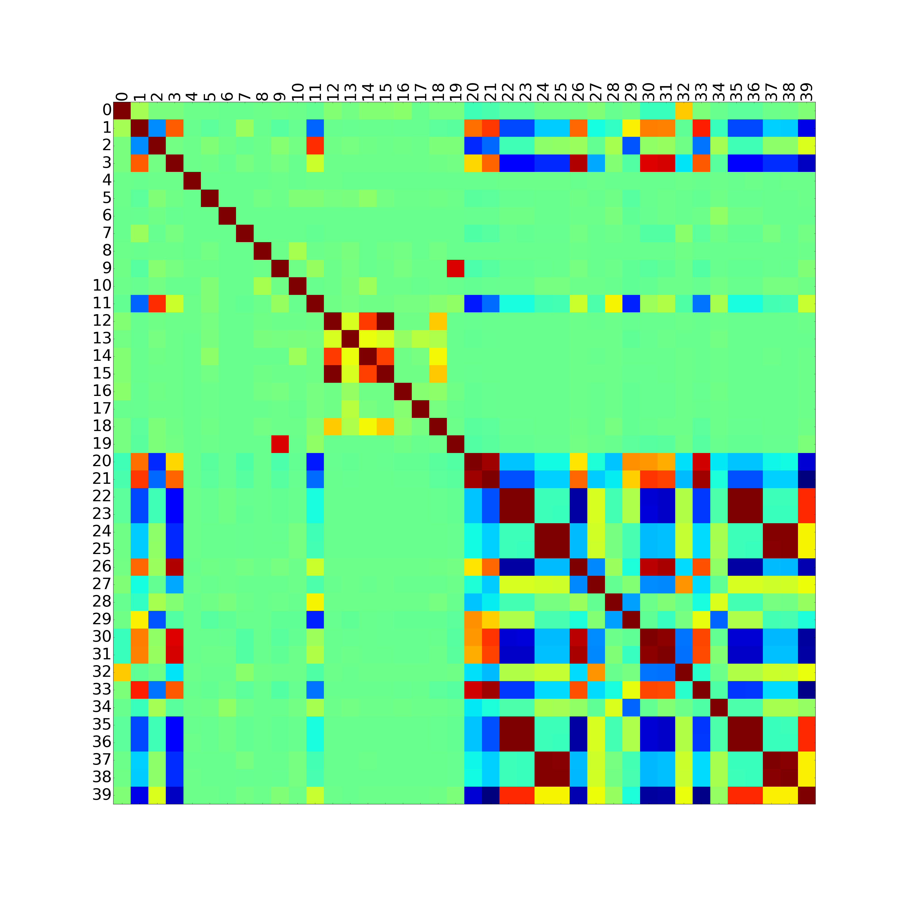
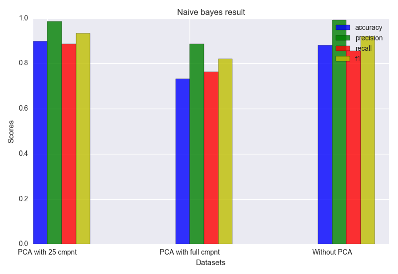
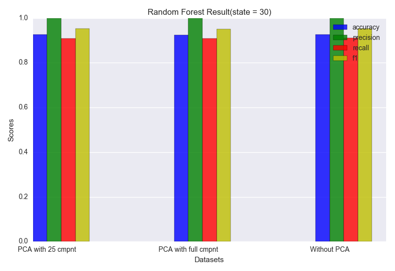
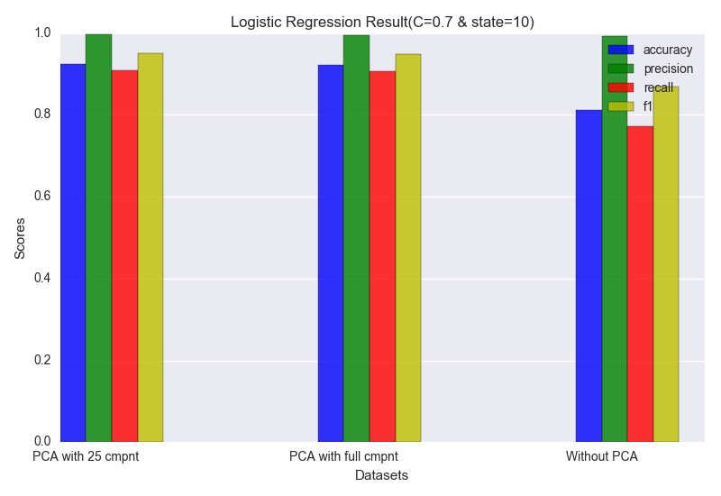
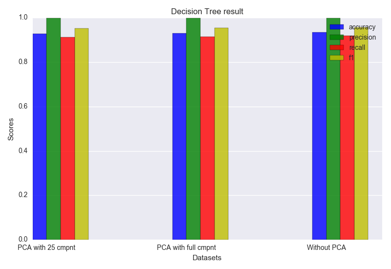
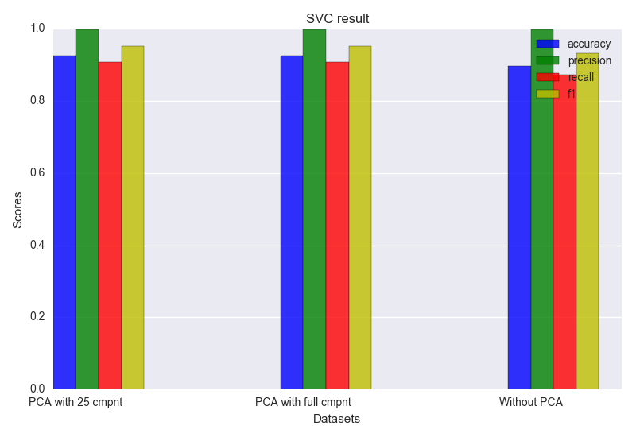

# IDS-KDDcup
Detecting Abnormal Connections of a Network Flow(KDD-cup 99)

## Understanding Data
try to find out what is dataset different classes

.png)
.png)

### after mapping string value to numeric and divide all class to normal and abnormal

## Prepare Data
  ### Feature redunction

.png)

  ### PCA
.png)

.png)

.png)

.png)

## IDS
   ### Naive bayes

  ### Random Forest

  ### Logistic Regression

  ### Decision Tree

  ### SVC

  ### Compare algorithms

